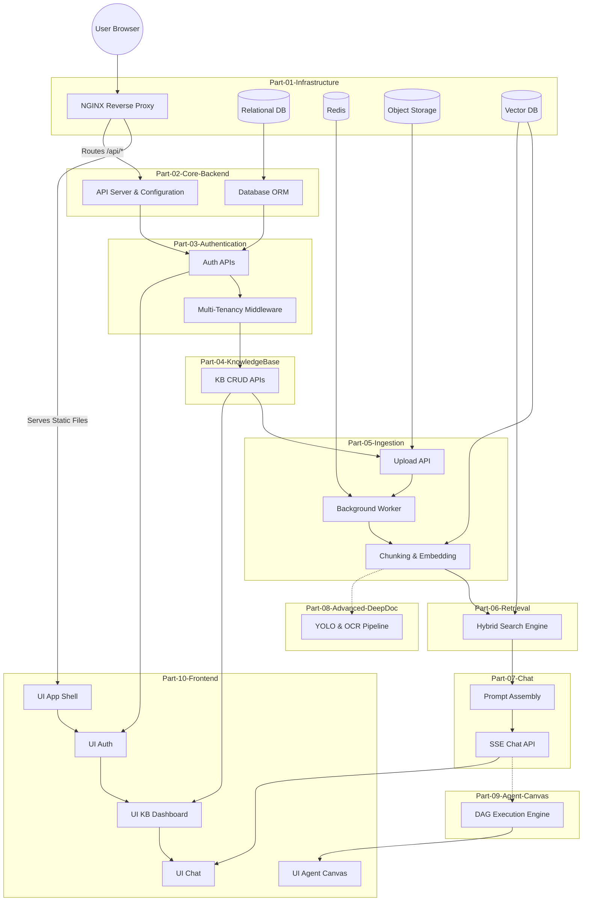

# Global Dependencies

## System Dependencies

This document outlines the strict dependencies between the implementation parts of the devRAG recreation project. You must not attempt to build a dependent part before its prerequisites are fully verified.

### Core Component Dependency Graph

## Dependency Rules

1. **Infrastructure First (DOCUMENTED)**: Application code cannot run without state stores and the edge proxy. (`Part-01` must be verified before `Part-02`).
2. **Security Before Data (DOCUMENTED)**: RAGFlow relies on strict data isolation (`tenant_id`). You cannot create Knowledge Bases or Documents until the Multi-Tenancy interceptor is active. (`Part-03` before `Part-04`).
3. **Ingestion Before Retrieval (INFERRED)**: You cannot search a Vector DB that has no data. (`Part-05` before `Part-06`).
4. **Retrieval Before Chat (DOCUMENTED)**: The LLM needs context to answer questions. (`Part-06` before `Part-07`).
5. **Frontend Trails Backend (PROPOSED)**: While UI mocks can be built concurrently, the actual Frontend logic requires stable API contracts routed through NGINX. `Part-10` subparts should be built immediately after their corresponding backend parts are verified.
6. **Advanced Features Last (PROPOSED)**: DeepDoc (Vision) and Agent Canvas (DAGs) are extremely complex. They should only be attempted after the core text-based Q&A loop is functional. (`Part-08` and `Part-09` at the end).
