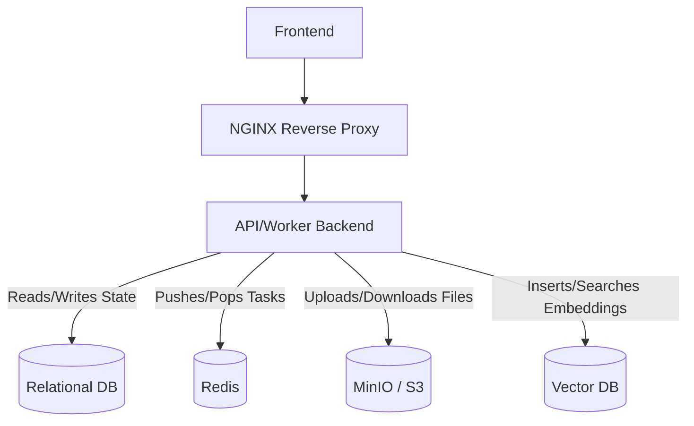

# Part 01: Infrastructure

## 5.1 Part Overview
This part establishes the foundational infrastructure and data layer. You are provisioning the stateful services that store relational data, cache task queues, hold raw files, persist vector embeddings, and route edge traffic. This is strictly required before any application code can be executed.

## 5.2 Scope
### Included Functionality
*   MySQL for relational transactional state.
*   Redis for async worker queues and caching.
*   MinIO for raw object storage.
*   Infinity (or Elasticsearch) for vector storage.
*   NGINX for edge proxying and static asset serving.

### Excluded Functionality
*   Database table creation (handled via ORM in Part 02).
*   Vector DB Index creation (handled in Part 05).

## 5.3 Architecture
### Services & Data Flow

## 5.4 Implementation Order
1.  **01-Relational-DB**: Relational stores are fundamental to User and Tenant creation.
2.  **02-Redis-Cache**: Required for task execution.
3.  **03-Object-Storage**: Required for file uploads.
4.  **04-Vector-DB**: Required for document vectorization.
5.  **05-Nginx-Proxy**: Required to route UI and Backend traffic.

## 5.5 Subpart Index
*(Includes Subpart Name, Objective, Dependencies, Expected Inputs/Outputs, and Priority)*

*   **`01-Relational-DB`**: Provisions MySQL/Postgres for transactional state. (High Priority)
*   **`02-Redis-Cache`**: Provisions Redis for async workers and locks. (High Priority)
*   **`03-Object-Storage`**: Provisions MinIO for file blobs. (High Priority)
*   **`04-Vector-DB`**: Provisions Infinity/Elasticsearch for embedding storage. (High Priority)
*   **`05-Nginx-Proxy`**: Provisions NGINX to route UI and backend traffic. (High Priority)

## 5.6 End-to-End Verification
### Expected Results and Verification Flow
*   All five distinct services are running locally via Docker Compose.
*   Ports are correctly mapped and isolated via a custom Docker bridge network.
*   The `docker ps` command shows all containers as `healthy`.
*   You can connect to MySQL, Redis, and MinIO locally using desktop GUI clients.
