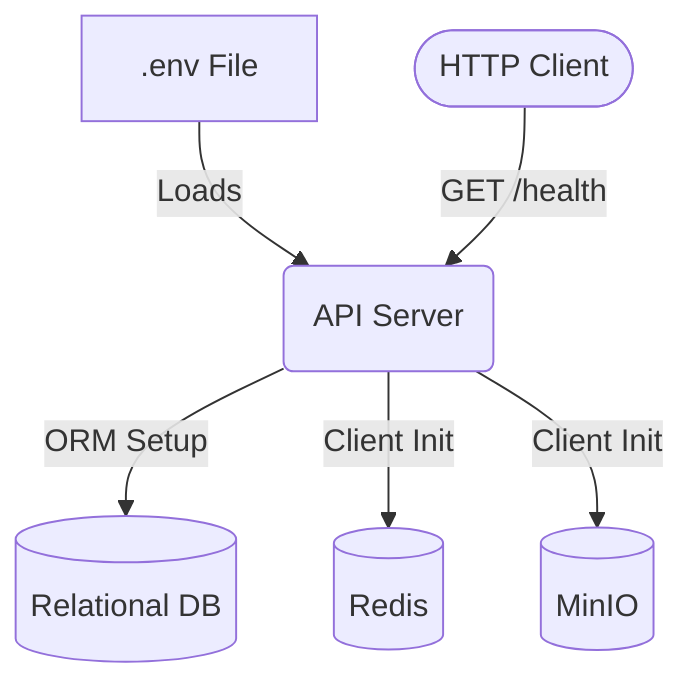

# Part 02: Core Backend

## 5.1 Part Objective
The objective of this part is to scaffold the backend application server. This creates the execution environment, establishes the API routing layer, and wires up connections to the infrastructure provisioned in Part 01. It is the necessary foundation for all subsequent business logic and machine learning tasks.

*Relevant Docs*: `docs/03-backend/architecture.md`.

## 5.2 Prerequisites
*   **Required previous parts**: `Part-01-Infrastructure` must be complete and running.
*   **Required knowledge**: Backend programming in your chosen framework (e.g., Python/FastAPI, Node/Express, Go/Gin).
*   **Required infrastructure**: The 4 running Docker containers from Part 01.

## 5.3 Internal Subparts
*   **`01-Project-Initialization`**: Scaffolding the repository, dependencies, and a basic health-check API.
*   **`02-Configuration-Management`**: Loading `.env` credentials securely.
*   **`03-Database-Connection`**: Setting up the Object-Relational Mapper (ORM) and connecting to MySQL/Postgres.
*   **`04-External-Clients`**: Initializing singleton connections to Redis and MinIO.

## 5.4 Overall Data Flow

## 5.5 Overall Implementation Order
The order is strictly sequential. You must initialize the project (01) before you can write code to load configs (02). You need configs (02) before you can connect to the database (03) and external clients (04).

## 5.6 Expected Final Result
*   A running API server listening on a local port (e.g., 8000).
*   A `/health` endpoint that returns 200 OK.
*   Application logs indicating successful connections to the Relational DB, Redis, and MinIO.
*   The server crashes explicitly on startup if any of these infrastructure connections fail (fail-fast architecture).

## 5.7 Scope Exclusions
*   No database schemas or models (e.g., User, Tenant) are created yet.
*   No business logic endpoints are implemented.
*   Vector DB connections are excluded from this phase to keep the initial client setup simple; they will be implemented in the Ingestion phase.

## 5.8 Documentation References
*   `docs/03-backend/architecture.md`
