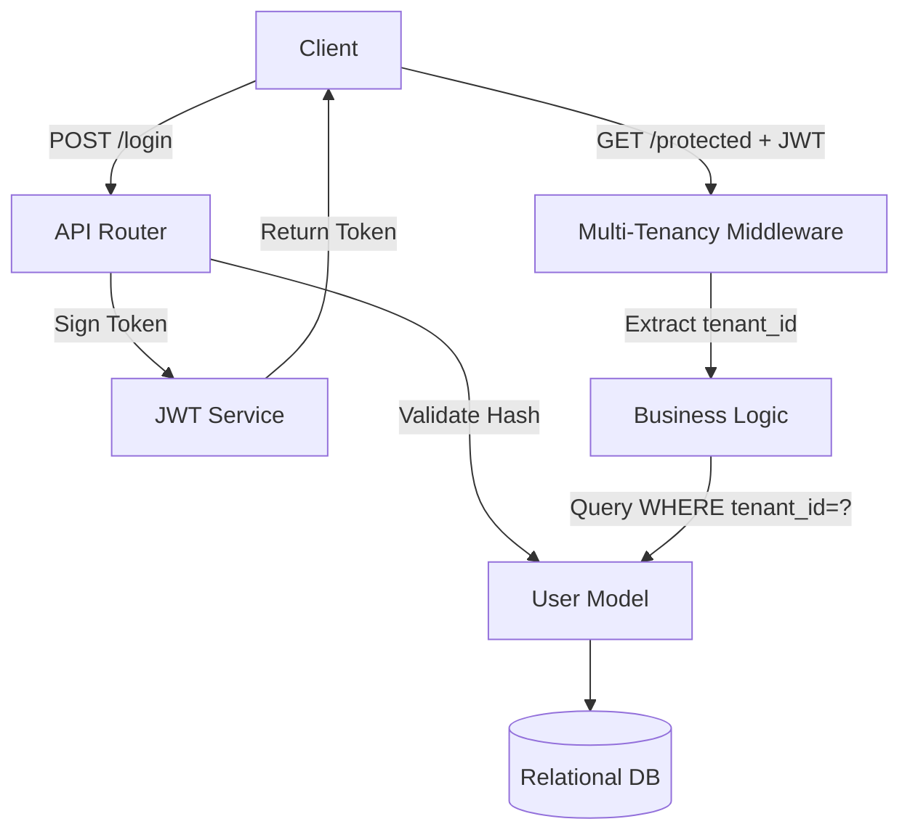

# Part 03: Authentication & Tenancy

## 5.1 Part Objective
This part builds the foundational security layer. RAGFlow is a multi-tenant system designed for enterprise use; data leakage between users is catastrophic. This part implements the ORM models, the authentication JWT flow, and crucially, the middleware that guarantees strict `tenant_id` isolation across all database queries.

*Relevant Docs*: `docs/16-auth/authentication.md`, `docs/16-auth/multi-tenancy.md`.

## 5.2 Prerequisites
*   **Required previous parts**: `Part-02-Core-Backend` (ORM and API server must be functional).
*   **Required knowledge**: JWT generation/validation, database migrations, and writing middleware in your chosen web framework.

## 5.3 Internal Subparts
*   **`01-User-Tenant-Models`**: Defining the physical database tables via the ORM.
*   **`02-Auth-APIs`**: Building the `/register` and `/login` HTTP endpoints.
*   **`03-Multi-Tenancy-Middleware`**: Building the security interceptor that guards the rest of the application.

## 5.4 Overall Data Flow

## 5.5 Overall Implementation Order
The order is sequential. You cannot write login APIs (02) without the user tables existing in the database (01). You cannot write the multi-tenancy middleware (03) until you have a valid JWT containing the `tenant_id` to extract (02).

## 5.6 Expected Final Result
*   Two new tables in the database: `Tenant` and `User`.
*   A working registration and login system.
*   A middleware function ready to be wrapped around future Knowledge Base and Document endpoints.

## 5.7 Scope Exclusions
*   OAuth, SSO, API Keys, and complex Role-Based Access Control (RBAC) are excluded for the MVP.
*   Password reset flows and email verification are excluded.

## 5.8 Documentation References
*   `docs/16-auth/authentication.md`
*   `docs/16-auth/multi-tenancy.md`
