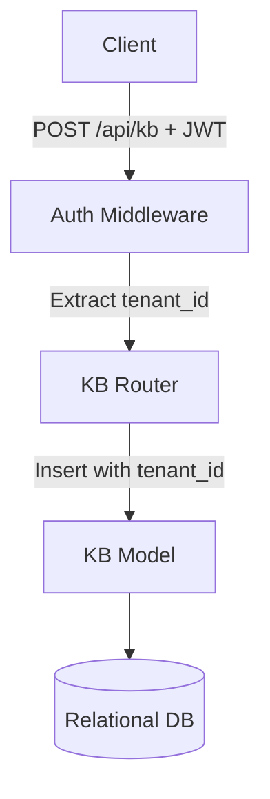

# Part 04: Knowledge Base Management

## 5.1 Part Objective
The objective of this part is to build the REST API required to manage Knowledge Bases (KBs). In RAGFlow, a Knowledge Base acts as a logical container (a folder) for documents. All searches and chats are scoped to a specific Knowledge Base.

*Relevant Docs*: `docs/04-api/knowledge-base.md`.

## 5.2 Prerequisites
*   **Required previous parts**: `Part-03-Authentication-Tenancy` must be complete. The multi-tenancy middleware is mandatory here.
*   **Required knowledge**: REST API design.

## 5.3 Internal Subparts
*   **`01-KB-Model-and-CRUD`**: Creating the database model and the Create, Read, Update, Delete HTTP endpoints.

## 5.4 Overall Data Flow

## 5.5 Overall Implementation Order
This part is small and linear. Define the model -> Apply Migrations -> Write the endpoints.

## 5.6 Expected Final Result
*   An authenticated user can fully manage their Knowledge Bases via HTTP API.
*   The Knowledge Base IDs generated here will be used in Part 05 to upload documents into them.

## 5.7 Scope Exclusions
*   Uploading documents into the KB is deferred to Part 05.
*   Complex KB settings (like overriding embedding models per KB) are deferred.

## 5.8 Documentation References
*   `docs/04-api/knowledge-base.md`
