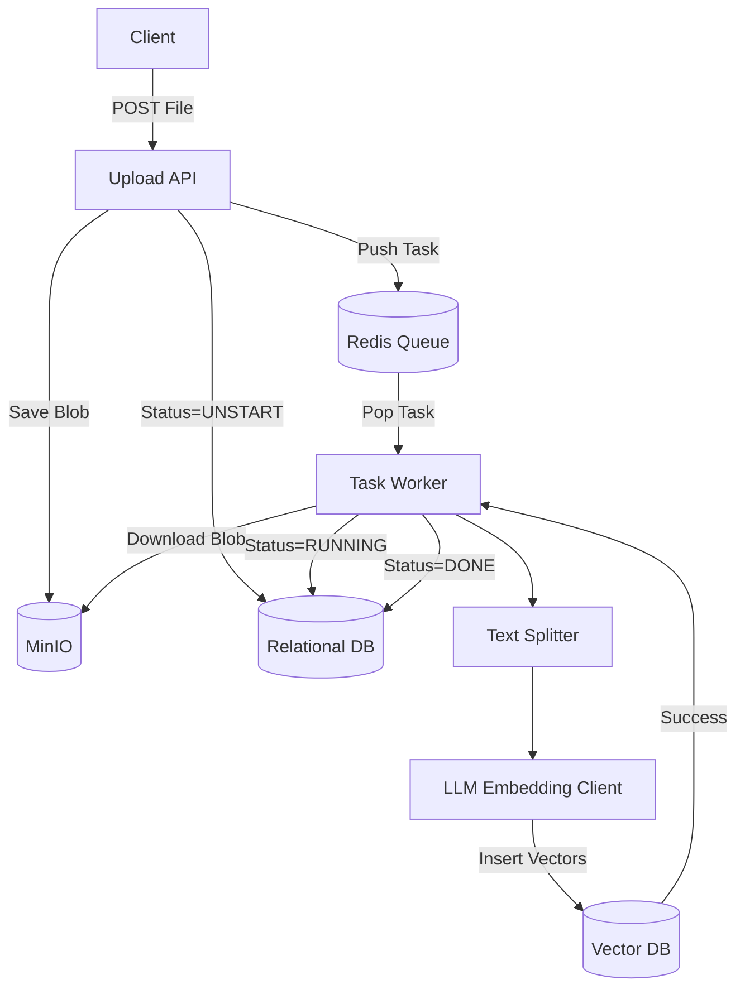

# Part 05: Document Ingestion

## 5.1 Part Objective
This part builds the core data processing pipeline. It orchestrates the journey of a user's file from an HTTP upload to searchable vector embeddings in the database.

*Relevant Docs*: `ragflow-docs/05-rag-pipeline/ingestion-pipeline.md`, `ragflow-docs/06-document-processing/upload.md`.

## 5.2 Prerequisites
*   **Required previous parts**: `Part-04-KnowledgeBase-Management`. You need a KB ID to attach the document to.
*   **Required infrastructure**: S3/MinIO, Redis, and Vector DB must be running.

## 5.3 Internal Subparts
*   **`01-Upload-API`**: Receiving the file, saving it to S3, and queuing a task.
*   **`02-Task-Workers`**: Building the background daemon to process tasks from Redis.
*   **`03-Chunking-and-Embedding`**: The actual ML logic to split text and insert vectors.

## 5.4 Overall Data Flow

## 5.5 Overall Implementation Order
The implementation must follow the data flow. Build the Upload API first (01), then the Worker skeleton to consume the task (02), and finally the actual processing logic inside the worker (03).

## 5.6 Expected Final Result
*   A fully decoupled, asynchronous ingestion pipeline.
*   Uploading a text file results in populated vector indexes without blocking the HTTP response.

## 5.7 Scope Exclusions
*   DeepDoc Vision parsing (YOLO, PDFs) is deferred to Part 08. This part focuses exclusively on plain text (`.txt` or `.md`) files to validate the pipeline infrastructure.

## 5.8 Documentation References
*   `ragflow-docs/05-rag-pipeline/ingestion-pipeline.md`
