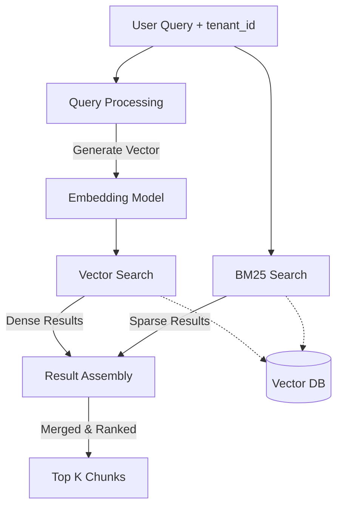

# Part 06: Retrieval Engine

## 5.1 Part Objective
This part builds the search backend. It takes a user's natural language query and finds the most relevant chunks of text stored in the Vector Database, strictly filtering by tenant isolation. 

*Relevant Docs*: `docs/07-retrieval/hybrid-search.md`.

## 5.2 Prerequisites
*   **Required previous parts**: `Part-05-Document-Ingestion`. You cannot build a search engine without populated data.

## 5.3 Internal Subparts
*   **`01-Query-Processing`**: Converting the user's text query into a vector.
*   **`02-Vector-Search`**: Executing the Dense (Cosine Similarity) search.
*   **`03-BM25-Search`**: (Optional MVP) Executing the Sparse (Keyword) search.
*   **`04-Result-Assembly`**: Merging, deduplicating, and ranking the results.

## 5.4 Overall Data Flow

## 5.5 Overall Implementation Order
Sequential. You must process the query (01) before searching (02/03). You must search before you can assemble results (04).

## 5.6 Expected Final Result
*   An internal programmatic service (e.g., a function or class) that takes `(query, kb_ids, tenant_id)` and returns an array of `Chunk` objects containing raw text.
*   This service will be consumed by the Chat API in Part 07.

## 5.7 Scope Exclusions
*   Cross-Encoder Reranking: RAGFlow uses a secondary ML model to re-score the merged results. This is excluded from the MVP assembly step (04) to reduce complexity.
*   HTTP APIs: The retrieval engine is an internal service.

## 5.8 Documentation References
*   `docs/07-retrieval/hybrid-search.md`
