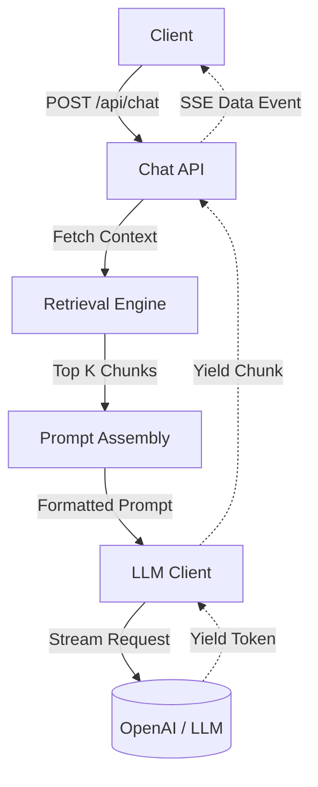

# Part 07: Chat and Streaming

## 5.1 Part Objective
This part builds the conversational interface of the backend. It takes a user query, fetches context via the Retrieval Engine, injects citation markers, queries a chat LLM, and streams the answer back to the user via Server-Sent Events (SSE).

*Relevant Docs*: `ragflow-docs/05-rag-pipeline/prompt-engineering.md`, `ragflow-docs/12-chat/streaming.md`.

## 5.2 Prerequisites
*   **Required previous parts**: `Part-06-Retrieval-Engine` (to fetch context).
*   **Required external services**: Access to an LLM provider (e.g., OpenAI, Anthropic, or local Ollama).

## 5.3 Internal Subparts
*   **`01-Prompt-Assembly`**: Formatting the context and injecting `##0$$` markers.
*   **`02-LLM-Client`**: Building the streaming HTTP client for the LLM.
*   **`03-Chat-API`**: Building the `POST /api/chat` route and SSE response logic.

## 5.4 Overall Data Flow

## 5.5 Overall Implementation Order
Sequential. Build the string manipulator (01), wrap the external LLM API (02), and finally expose the internal API endpoint (03).

## 5.6 Expected Final Result
*   A user can ask a question, and the server streams back an answer grounded in their uploaded documents, complete with citations.
*   This completes the Core MVP of RAGFlow.

## 5.7 Scope Exclusions
*   Conversation History (Memory): For the MVP, we ignore previous chat messages to simplify the prompt structure.
*   Frontend UI: This is purely backend SSE streaming.

## 5.8 Documentation References
*   `ragflow-docs/12-chat/streaming.md`
