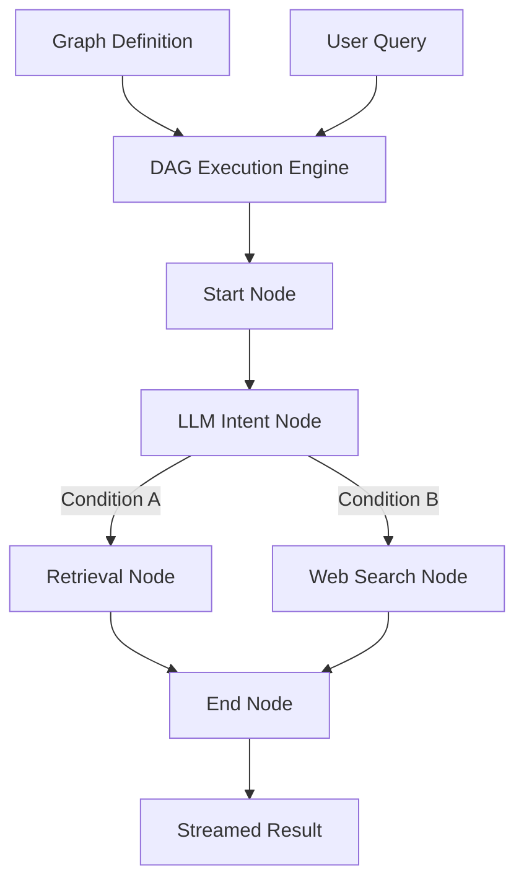

# Part 09: Agent Canvas & Workflows

## 5.1 Part Objective
This part builds the execution engine that replaces the hardcoded Chat flow (Part 07) with dynamic, user-configurable Directed Acyclic Graphs (DAGs). This allows users to build workflows that execute multiple LLM calls, run conditional routing, and call external tools (like Web Search).

*Relevant Docs*: `ragflow-docs/13-agents/canvas.md`, `ragflow-docs/14-workflows/execution.md`.

## 5.2 Prerequisites
*   **Required previous parts**: `Part-07-Chat-and-Streaming` (LLM clients and Streaming must be understood).

## 5.3 Internal Subparts
*   **`01-DAG-Engine`**: The core state machine that traverses a graph definition.
*   **`02-Base-Nodes`**: Implementations of the individual blocks (Start, LLM, Retrieval, End).
*   **`03-Agent-API`**: The endpoint to trigger executions.

## 5.4 Overall Data Flow

## 5.5 Overall Implementation Order
Sequential. The Engine (01) is the core logic. Nodes (02) plug into the Engine. The API (03) exposes it.

## 5.6 Expected Final Result
*   An API endpoint that takes a JSON graph definition and executes it step-by-step.

## 5.7 Scope Exclusions
*   Python Sandboxing: Dockerized code execution is excluded for security reasons.
*   Visual UI builder.

## 5.8 Documentation References
*   `ragflow-docs/13-agents/canvas.md`
