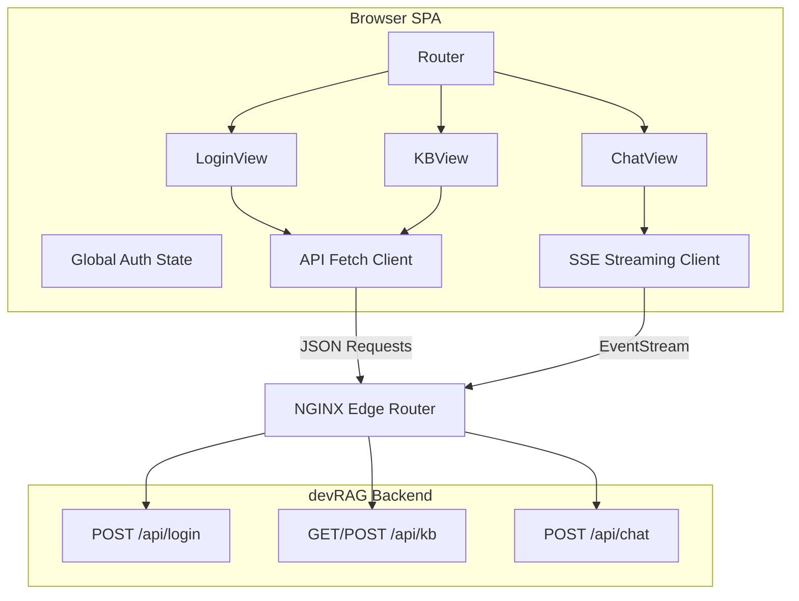

# Part 10: Frontend Implementation

## 5.1 Part Overview
The purpose of this part is to build the devRAG web application. It provides the visual interfaces for users to authenticate, manage workspaces, upload unstructured documents, monitor processing pipelines, and interact with the RAG pipeline via a conversational chat interface. This part transitions the project from a set of headless APIs into a usable product. It depends entirely on the completion of Parts 01-07.

## 5.2 Scope
*   **Included functionality**: Application shell, routing, global state management, login/registration, Knowledge Base (KB) dashboard, document upload with polling, and the streaming chat interface.
*   **Excluded functionality**: Agent Canvas UI builder (deferred to advanced phases).
*   **Optional functionality**: Dark mode toggling.
*   **Depends on unresolved documentation**: Exact API payload structures (e.g., KB creation JSON) are `PROPOSED` because they are `UNKNOWN` in the source documentation.

## 5.3 Architecture
The frontend is a Single Page Application (SPA). 

*   **Modules**: Core Routing, Auth Context, API Client, UI Component Library.
*   **Communication protocols**: REST (via `fetch` or Axios) for CRUD operations. Server-Sent Events (SSE) for streaming chat.
*   **Data flow**:

## 5.4 Implementation Order
1.  **`01-Frontend-Core`**: Must exist first to provide the React/Vue skeleton, router, and base UI shell.
2.  **`02-Auth-UI`**: Must be built next to obtain the JWT required by all subsequent APIs.
3.  **`03-KB-Dashboard`**: Built next to allow users to create the logical containers for data.
4.  **`04-Document-Management`**: Depends on KB existence. Allows users to upload files and see them process.
5.  **`05-Chat-Interface`**: The final MVP step. Depends on uploaded documents existing in the backend to provide meaningful context.

## 5.5 Subpart Index
*   **01-Frontend-Core**:
    *   *Objective*: Initialize project and routing.
    *   *Dependencies*: None.
    *   *Expected inputs*: Dev commands.
    *   *Expected outputs*: Running localhost server with an empty shell.
    *   *Related docs*: `ragflow-docs/02-frontend/architecture.md`
    *   *Priority*: High
*   **02-Auth-UI**:
    *   *Objective*: Build Login/Register screens.
    *   *Dependencies*: 01-Frontend-Core, Part 03 Backend.
    *   *Expected inputs*: Credentials.
    *   *Expected outputs*: Stored JWT.
    *   *Priority*: High
*   **03-KB-Dashboard**:
    *   *Objective*: View and create Knowledge Bases.
    *   *Dependencies*: 02-Auth-UI, Part 04 Backend.
    *   *Expected inputs*: KB Name/Desc.
    *   *Expected outputs*: API success, UI list update.
    *   *Priority*: High
*   **04-Document-Management**:
    *   *Objective*: Upload files and poll status.
    *   *Dependencies*: 03-KB-Dashboard, Part 05 Backend.
    *   *Expected inputs*: File blobs.
    *   *Expected outputs*: Upload progress bar, Status table (`UNSTART` -> `DONE`).
    *   *Priority*: High
*   **05-Chat-Interface**:
    *   *Objective*: SSE streaming chat.
    *   *Dependencies*: 04-Document-Management, Part 07 Backend.
    *   *Expected inputs*: User query text.
    *   *Expected outputs*: Markdown rendered text with citations.
    *   *Priority*: High

## 5.6 End-to-End Verification
To verify the entire frontend part works:
1.  Start the frontend dev server and the backend API server.
2.  Navigate to `/login` and create an account.
3.  Observe successful redirection to `/dashboard`.
4.  Click "Create Knowledge Base", enter details, and observe the new KB appear in the grid.
5.  Navigate into the KB, click "Upload Document", and select a `.txt` file.
6.  Observe the status change from `Running` to `Done` automatically (via polling).
7.  Navigate to the `/chat` route, select the KB, and ask a question.
8.  Observe the answer streaming in real-time with Markdown citations.
9.  **Acceptance Criteria**: The user can perform all RAG actions entirely through the graphical interface without using external tools or viewing network errors.
